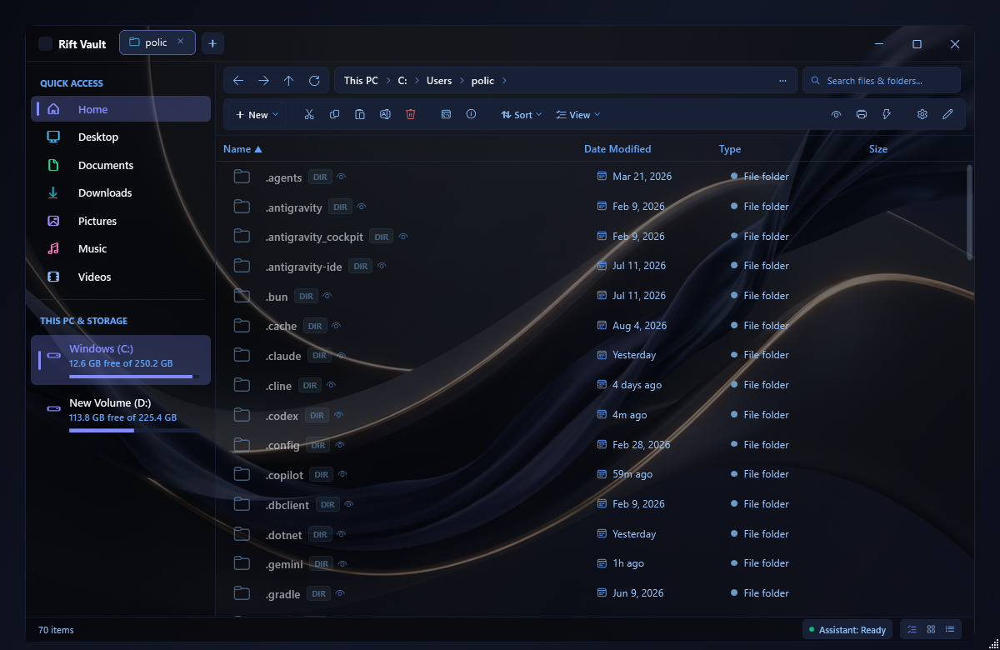
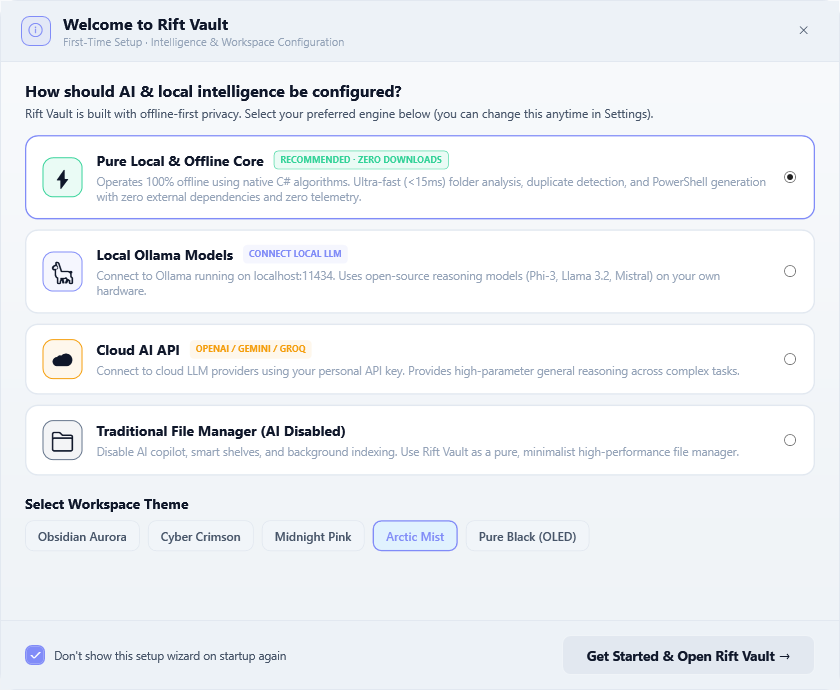
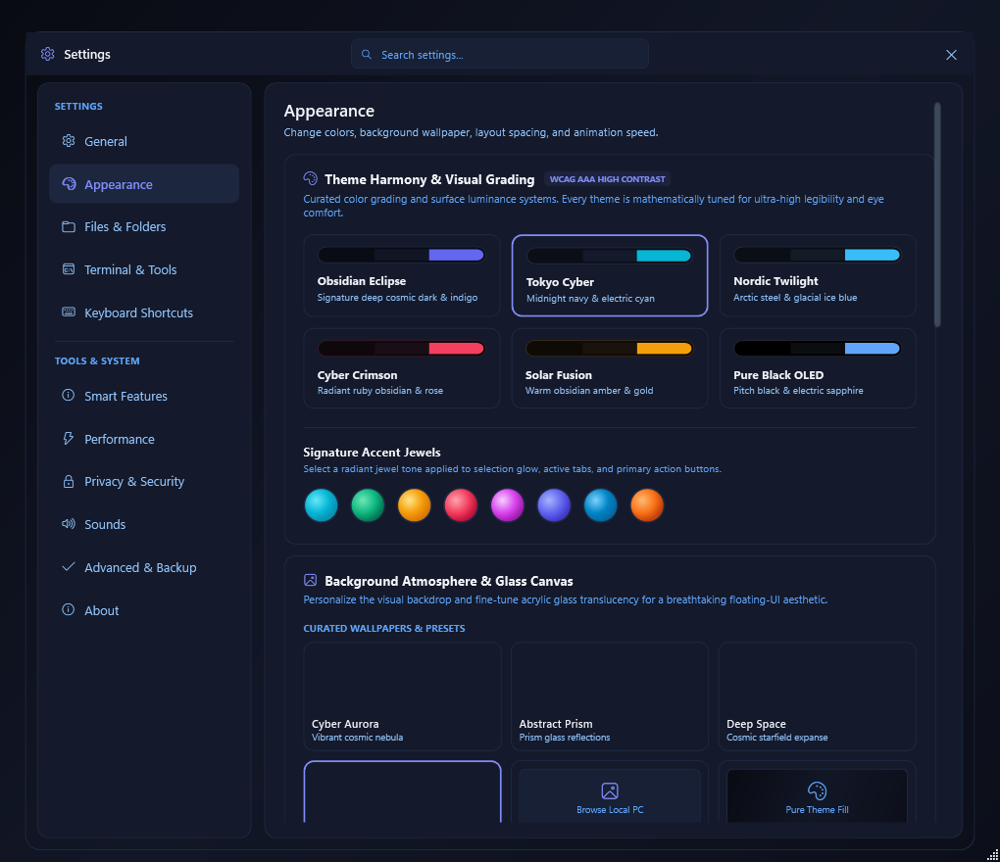

<div align="center">

# ⚡ Rift Vault

### Next-Generation, High-Performance Windows File Explorer & Encrypted Vault

[](https://www.gnu.org/licenses/gpl-3.0)
[](https://dotnet.microsoft.com/download/dotnet/8.0)
[](https://microsoft.com/windows)
[](https://github.com/StromOG/Rift-Vault)
[](CONTRIBUTING.md)

<p align="center">
  <b>Rift Vault</b> is an open-source, ultra-responsive file manager for Windows designed for speed, privacy, and visual elegance. Built from the ground up with <b>.NET 8</b>, direct <b>Win32 API interop</b>, native <b>Mica/Acrylic glass surfaces</b>, and <b>100% local, on-device AI intelligence</b>.
</p>

---

[Key Features](#-key-features) •
[Screenshots](#-preview--screenshots) •
[Architecture](#-architectural-overview) •
[Getting Started](#-getting-started) •
[Developer Guide](#-developer-build-guide) •
[Contributing](#-contributing) •
[License](#-license)

</div>

---

## 📸 Preview & Screenshots

<div align="center">

### Main Workspace & Elevated File Canvas


<br/><br/>

### First-Run Setup & Sequential Experience


<br/><br/>

### Appearance, Theming & Physics Engine


</div>

---

## ✨ Key Features

### 🚀 Blazing Native Performance
- **Win32 Direct I/O Traversal**: Employs direct `FindFirstFileExW` / `FindNextFileW` interop, bypassing managed reflection overhead to enumerate thousands of files in milliseconds.
- **Virtualized Pixel Scrolling**: Ultra-fluid momentum scrolling powered by WPF virtualized stack panels with zero dropped frames.
- **Hardware Thumbnail Pipeline**: High-DPI Windows Shell thumbnail extraction with intelligent in-memory LRU caching.

### 🎨 Fluent 2 Layered Depth & Mica Backdrop
- **Elevated Island Canvas**: Physical layered depth structure with floating card file viewports, soft elevation drop shadows, and 8px/16px rounded corners.
- **Native Windows 11 DWM Rounding**: Direct Win32 Desktop Window Manager integration (`DWMWA_WINDOW_CORNER_PREFERENCE`) for true edge-to-edge window framing.
- **Curated Theme Suite**: Handcrafted dark and light theme palettes including *Obsidian Aurora*, *Solar Fusion*, *Tokyo Cyber*, *Nordic Twilight*, *Fluent Light*, and *Sandstorm Peach*.

### 🧭 Smart Address Omnibar & Live Suggestions
- **Fixed Non-Drifting Viewport**: Single-line precision address entry with vertical displacement locking and clean line padding.
- **Real-Time Auto-Complete**: Instant suggestion popup providing subfolder enumeration, partial path matching, drive roots, shell shortcuts, and visited history as you type.
- **Keyboard Navigation**: Browse suggestions effortlessly using `Up` / `Down` arrow keys, auto-complete directories with `Tab`, and navigate instantly with `Enter`.

### 🛡️ Built-in Encrypted Security Vault
- **AES-256 Vault**: Integrated encrypted file vault accessible directly from the navigation sidebar. Lock, encrypt, shred, and protect sensitive files without third-party software.
- **Zero-Cloud Guarantee**: All operations, encryption keys, and indexing run strictly on your local machine.

### 🤖 100% On-Device Local AI Intelligence
- **FileDNA**: On-device image tagging and semantic classification using local MobileNet ONNX models.
- **DuplicateBrain**: Instant duplicate detection engine combining file size bucketing with cryptographic MD5 / SHA-256 hashing.
- **AutoOrganizer**: K-Means clustering engine suggesting logical file grouping and tidy folder organization.
- **Local Ollama Integration**: Seamless bridge to local AI models (Phi-3, Llama 3) via standard local endpoints with zero internet dependency.

### ⚡ Power-User Productivity
- **Tabbed Browsing & Dual-Pane**: Split-view commander workflow for rapid side-by-side file transfers and comparison.
- **Modular Toolbar Customizer**: Drag-and-drop customizable toolbar strips—enable, disable, and rearrange actions to suit your workflow.
- **Teleport Hotkeys**: Assign frequent directories to quick-jump shortcuts (`Ctrl+1` through `Ctrl+9`).

---

## 🛠️ Architectural Overview

Rift Vault is architected using modern Clean Architecture principles and the MVVM (Model-View-ViewModel) design pattern:

```
RiftVault/
├── AI/                     # On-device machine learning (FileDNA, SmartShelf, DuplicateBrain, Ollama)
├── Animations/             # Physics-based spring animations & RK4 numerical solver
├── Assets/                 # Wallpapers, vector icon assets, and branding resources
├── Core/                   # Native file system engine, search indexer, clipboard, archives
├── Models/                 # Immutable domain models (FileItem, TabState, AppSettings)
├── Services/               # Core application services (Vault, Tags, Themes, Audio, Settings)
├── UI/                     # Presentation layer, modular dialogs, and setup wizards
│   ├── Controls/           # Reusable UI controls (PreviewPane, BreadcrumbBar, SmoothScrollViewer)
│   └── Themes/             # XAML ResourceDictionaries (FluentLight, FluentDark, SolarFusion, etc.)
├── ViewModels/             # CommunityToolkit.Mvvm view models with command binding
├── Win32/                  # Native P/Invoke interop (Mica backdrop, Shell Icons, DWM attributes)
├── App.xaml / App.xaml.cs  # Application lifecycle, CLI argument router & theme bootstrap
└── MainWindow.xaml         # Main explorer window layout and view hosts
```

### Technology Stack
- **Framework**: [.NET 8.0 Windows Desktop](https://dotnet.microsoft.com/)
- **UI Subsystem**: WPF (Windows Presentation Foundation) with DirectX hardware acceleration
- **Architecture**: `CommunityToolkit.Mvvm` (Source Generators, ObservableObject, RelayCommand)
- **Native Interop**: Direct Win32 P/Invoke (`shell32.dll`, `dwmapi.dll`, `user32.dll`, `kernel32.dll`)
- **ML / AI**: `Microsoft.ML.OnnxRuntime` + Local REST Ollama API

---

## 💻 Getting Started

### Prerequisites
- **Operating System**: Windows 10 (Build 1903+) or Windows 11
- **Runtime**: [.NET 8.0 Desktop Runtime](https://dotnet.microsoft.com/download/dotnet/8.0) (or [.NET 8 SDK](https://dotnet.microsoft.com/download/dotnet/8.0) for developers)

### Quick Launch
Clone the repository and run via the .NET CLI:

```bash
# Clone the repository
git clone https://github.com/StromOG/Rift-Vault.git
cd Rift-Vault

# Restore dependencies & run
dotnet run
```

---

## 🔧 Developer Build Guide

### Clone & Build

```bash
# Clone repository
git clone https://github.com/StromOG/Rift-Vault.git
cd Rift-Vault

# Build in Debug configuration
dotnet build

# Launch the application
dotnet run --no-build
```

### Building a Production Release

To create an optimized, self-contained single-file executable:

```bash
dotnet publish -c Release -r win-x64 --self-contained false -p:PublishSingleFile=true
```

The output binary will be located in:
`bin/Release/net8.0-windows10.0.18362.0/win-x64/publish/`

### Automated CLI Verification

Rift Vault features a rich suite of automated verification flags for continuous integration and headless testing:

```bash
# Run installer step verification
dotnet run -- --test-installer

# Run toolbar customizer tests
dotnet run -- --test-toolbar-customizer

# Test file access and Win32 enumeration
dotnet run -- --test-full-access
```

---

## 🤝 Contributing

We welcome contributions from developers, designers, and testers of all skill levels! Whether you're fixing a bug, adding a new theme, optimizing native Win32 interop, or expanding local AI capabilities:

1. **Fork the Repository** to your GitHub account.
2. **Create a Feature Branch** (`git checkout -b feature/amazing-feature`).
3. **Commit your Changes** (`git commit -m "feat: add amazing feature"`).
4. **Push to the Branch** (`git push origin feature/amazing-feature`).
5. **Open a Pull Request** describing your changes.

Please see [CONTRIBUTING.md](CONTRIBUTING.md) for detailed guidelines, code formatting standards, and developer workflows.

---

## 📄 License

This project is licensed under the **GNU General Public License v3.0** (GPLv3).

```
Rift Vault — Next-Generation Windows File Explorer
Copyright (C) 2026 StromOG & Rift Vault Contributors

This program is free software: you can redistribute it and/or modify
it under the terms of the GNU General Public License as published by
the Free Software Foundation, either version 3 of the License, or
(at your option) any later version.

This program is distributed in the hope that it will be useful,
but WITHOUT ANY WARRANTY; without even the implied warranty of
MERCHANTABILITY or FITNESS FOR A PARTICULAR PURPOSE.  See the
GNU General Public License for more details.
```

See the [LICENSE](LICENSE) file for the full license text.
